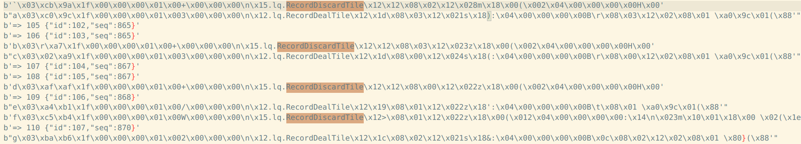
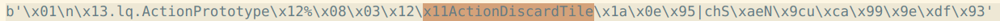

# maj_defender

一个用于在《雀魂》游戏中预测对手是否听牌以及听什么牌的ai智能体

## 动机

由微软开发的Suphx作为目前最强的日本麻将ai，其与人类棋手最大的不同在于放统率极低（约8%，而最顶尖的人类棋手也一般在18%左右）。也就是说，在ai经大量学习后得到的策略中，少放统是提升水平的一个关键要素。避免放统的关键在于分析对手的切牌情况（包括切出牌的类型，是否为摸切），然而人类棋手很难在打牌的过程中精确地记住对手所有的切牌信息，因此我们可以让计算机程序来替我们记住对手所有的切牌序列，并丢到训练好的模型中来分析对手的听牌情况。在这个项目中，人类棋手只需要享受ai分析的听牌情况，并在合适的时候勇敢地进攻。

## 训练数据获取

《雀魂》在对局结束后会收集牌谱，在[雀魂牌谱屋](https://amae-koromo.sapk.ch/)网站可以找到所有玩家的近1000局牌谱

```
https://game.maj-soul.com/1/?paipu=240922-088300ad-2dd7-4faa-9b57-5a69138f7052_a88895026
```

牌谱大概是以上格式的网址，可以直接输入到浏览器中观看

关于如何将<u>牌谱链接</u>转成可读的对局数据（json格式），参考[这篇bilibili文章](https://www.bilibili.com/read/cv36373732/)，其中记载了一段代码，只需要输入到浏览器的开发者工具控制台，便可以获取json格式的对局数据

而后通过`selenium`包自动化地在浏览器中执行这样的过程，就可以得到大量json格式的牌谱

## 模型1训练

输入：你的对手的切牌序列

输出：是否听牌

由于输入是与时间有关的序列，因此选择`LSTM`作为主要的模型架构。

由于输入的牌数量并不是固定的，因此在牌进行了独热编码后，需要将序列填充到相同的位数（不够的用padding不补齐）

实际上，该模型十分类似于NLP中用于分析文本情感的模型

## 监听雀魂对局数据

监听雀魂对局数据可以采用两种方案：

1. 使用计算机视觉分析目前的对局信息
2. 利用网络抓包抓取雀魂服务器实时发送的流量

实际上，实现方案一会更加地合情合理，类似一位人类玩家在进行观察。但是视觉方案实现成本更高，因此本项目暂时采用了网络抓包的方法。

关于如何对《雀魂》的实时对局数据进行抓包，本项目参考了[这个项目](https://github.com/747929791/majsoul_wrapper)

《雀魂》的所有实时对局数据是通过`Websocket`发送的，因此不能直接在浏览器开发者工具中监听到

但是可以利用`mitmproxy`抓包工具（中间人攻击），将所有进入计算机的流量（包括websocket）先转发到`mitmproxy`服务器上，并且可以通过`mitmproxy`提供的python脚本功能对这些流量进行处理。例如，在这个项目中，我们希望的是记录所有与《雀魂》对局信息有关的流量，并且在之后转发到其他脚本上进行进一步的解析

> 补充：
>
> 默认mitmproxy运行在8080端口上对浏览器进行流量监听，然而如果同时开启了clash网络代理（运行在7890端口上），那么他们是冲突的
>
> 解决方案也很简单，因为mitmproxy和clash都是网络代理，只需要将mitmproxy设置为clash的上游代理，通过mitmproxy的网络流量不直接进入计算机，而是转发到7890端口，则可以实现它们的共存
>
> 通过如下命令设置`mitmproxy`的下游代理
>
> ```
> mitmdump --mode upstream:http://127.0.0.1:7890
> ```



如果抓取到流量，大概会如上图所示，其中`RecordDiscardTile`就是《雀魂》发送过来的切牌信息

> 补充：
>
> `RecordDiscardTile`：牌谱对局中的切牌数据
>
> `ActionDiscardTile`：实时对局中的切牌数据
>
> 其他类似的英文名可以根据名称猜测其含义，比如`ActionNewRound,ActionNoTile`等等

这些流量是不可解释的，因为它们采用了谷歌提出的`protobuf`编码，对于他们的转译需要拿到《雀魂》的`liqi.proto`文件才可以，这些文件在以往的一些《雀魂》项目中往往可以找到，并且本项目未来也会提供这一文件。但是需要指出的是除了`proto`编码，目前雀魂的websocket数据似乎还经过了某种加密，不再像以前一样可以直接通过proto文件进行解析，因此本项目通过直接观察编码规律实现了一种直接分析不同编码所代表的牌的解析程序。但这样的解析在没有真正破解出加密方式之前，永远是不完全的。

> 待完成：学习解读加密的方法
>
> 参考项目：https://github.com/Avenshy/MajsoulMax/blob/main/plugin/helper.py

加密后的格式如下，如果是未加密版本，`ActionDiscardTile\xla\x0e`后应当是`\x08`，代表了这是proto编码中的第一个数据，但这里却是`\x95`



通过监听以及解析程序得到的数据如下（这里是以自定义的一种json文件存储），显然这样的数据就可以输入到ai中进行预测了

```json
{
    "results": [
        {
            "tile_in": [
                "?",
                "moqie",
                "moqie",
                "?",
                "?",
                "?"
            ],
            "tile_out": [
                "5z",
                "8p",
                "3z",
                "7z",
                "1m",
                "7s"
            ],
            "tingpai": 0,
            "tingpais": [
                "1z"
            ],
            "seat": "东"
        },
        {
            "tile_in": [
                "?",
                "moqie",
                "moqie",
                "?",
                "moqie"
            ],
            "tile_out": [
                "4z",
                "9p",
                "7z",
                "8m",
                "9p"
            ],
            "tingpai": 0,
            "tingpais": [
                "1z"
            ],
            "seat": "南"
        },
        {
            "tile_in": [
                "?",
                "?",
                "?",
                "?",
                "?",
                "chipenggang"
            ],
            "tile_out": [
                "2z",
                "2z",
                "1s",
                "9m",
                "6z",
                "1m"
            ],
            "tingpai": 0,
            "tingpais": [
                "1z"
            ],
            "seat": "西"
        },
        {
            "tile_in": [
                "moqie",
                "?",
                "?",
                "moqie",
                "moqie",
                "moqie"
            ],
            "tile_out": [
                "7z",
                "2z",
                "4z",
                "6z",
                "1z",
                "8s"
            ],
            "tingpai": 0,
            "tingpais": [
                "1z"
            ],
            "seat": "北"
        }
    ]
}
```

## 待续

项目目前仍处于未完成状态，需要做的事情还有增加模型预测的准确性以及对工具进行可用性包装。考虑到数据监听程序的敏感性，项目代码将在完成后完全开源

